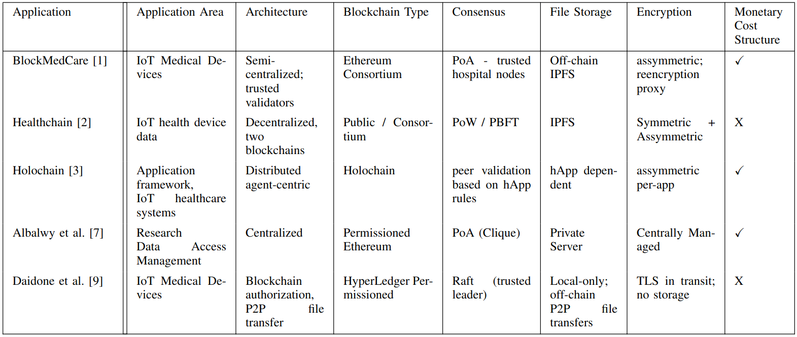
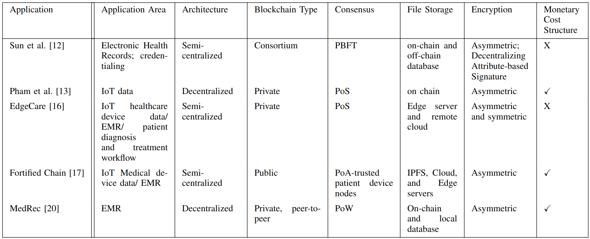
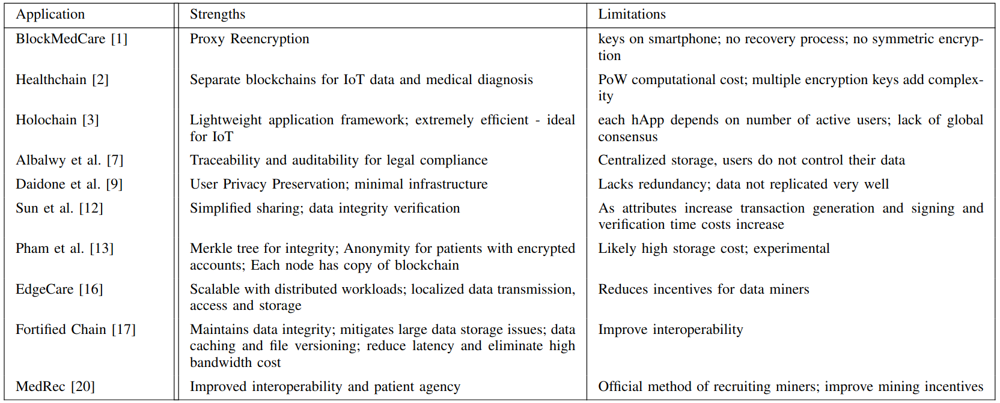
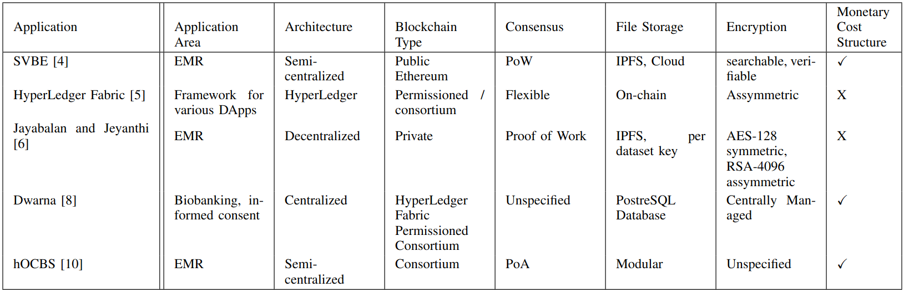
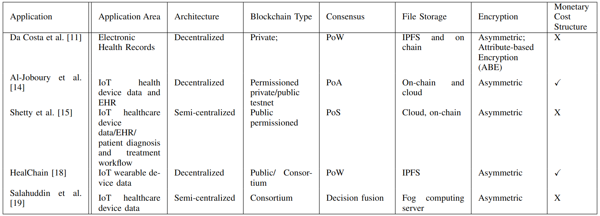
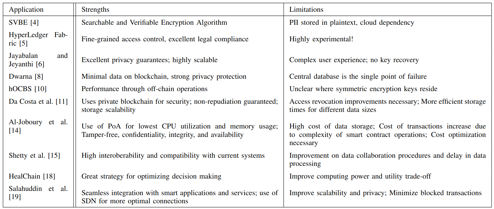

## Decentralized Protocols in Healthcare
### 01 December 2022
### Ariel Turnley
### Sonny Bhatia

Notes:

---

## Motivation

- Relevance
    - Healthcare data critical to security
    - IoT and ubiquitous computing 
    - Data storage increasingly complex issue

- Goals
    - Study and compare access control protocols in healthcare industry
    - Survey applications of Blockchain in decentralized networks
    - Compare and contrast different protocols
        - Security
        - Usability
        - Cost

Notes:

---

## Metrics

- Application Area - EHR, IoT data, billing, credentialing etc.
- Architecture - Centralized, Decentralized, Cloud, Hybrid etc.
- Blockchain Type - private, consortium, public
- Consensus - PoW, PoS, PoA, PBFT
- File Storage - on chain, IPFS, cloud
- Encryption - symmetric, asymmetric, combination
- Monetary Cost Structure
- Strengths - Confidentiality, Integrity, Availability, Interoperability, Implementation Effort
- Limitations - Scalability, Performance, Cost, Complexity

Notes:

- Monetary cost - who takes on the monetary cost of maintaining the decentralized network
- Data Ownership, Access Control??

---

## Comparison of Applications

Notes:

- BlockMedCare relies on trusted hospital nodes to form consensus through proof-of-authority
    - requires those servers to keep the network alive
    - others can keep a copy of shared state but that is just replication
- Healthchain does not clearly define cost structure
    - ultimately passes cost to patients through PoW
- Holochain is not blockchain
    - uses distributed ledger to create local consensus among peers
    - peers validate and sign transactions that can be later verified
- Albalwy created an access management system
    - everything is centralized except authorization data
- Daidone
    - no storage, central or decentralized
    - users keep their own data
    - share on-demand through secure P2P channels off-the-chain

--

## Comparison of Applications

Notes: 
- Attribute based signature scheme that utlizes a consortium blockchain for sharing and storing Electronic health records and ensuring that other doctors are credentialed before receiving EHR data.
- Stores data from health sensors on the blockchain where the hospital initializes all smart contracts for doctors and patients to monitor the patient's health.
- Utilizes an edge server for convenient local storage, distribute workloads geographically, and proxy external miner data. The global database is stored in the cloud.
- Utilizes a hybrid computing layer with a distributed topology including IPFS, cloud computing, edge computing. Where the edge computing topology takes on most of the computation and the cloud computing topology takes on most of the backup services.
- MedRec utilizes smart contracts to hold metadata regariding ownership, permissions, and data integrity. Utilizing a user's Ethereum address, the authors created a syncing algorithm to handle data enchanges that occur off-chain so that patient and provide databases are synced.
--

## Strengths and Limitations

Notes:

Please review... and ask questions!

--

## Comparison of Applications

Notes:

Here are more applications

- SVBE
    - searchable and verifiable encryption
    - required a second copy of all data on a cloud server
- HyperLedger
    - explored use of HyperLedger Fabric
    - tried storing files on chain, inefficient
    - text files only, base64
- Jayabalan and Jeyanthi
    - lean and decentralized approach
    - very detailed and well thought out
    - PoW transferred the cost to users
- Dwarna
    - informed consent
    - fully centralized
    - blockchain used to define permissions
- hOBCS
    - consortium for private access
    - used PoA for consensus - depended on centralized entity to provide infrastructure
    - modular storage options - IPFS, private server

--

## Comparison of Applications

Notes:

And some more...

--

## Strengths and Limitations

Notes:

And more strengths and limitations...

---

## Conclusion

- Blockchains
    - ✅ Integrity => Public Ledger
    - ✅ Availability => Massive Replication
    - ❌ Confidentiality
- Global consensus often not necessary => Holochain
- Centralized Systems hard to replace
- Monetary flow ultimately drives success

Notes:

- Integrity => Public Ledger
- Availability => replicate everything everywhere
- does not provide Confidentiality - except through use of PKI
- when would you actually need every system in the world to agree on something?
- lots of organizations chase the buzzword
- Centralized systems exist for a reason

---

## Discussion
- Proof-of-Authority => semi-centralized or centralized architecture
- Proof-of-Work is computationally expensive
- IPFS does not guarantee file availability
- Difficult to implement fully decentralized networks

Notes:
- IPFS necessitates encryption of data, but does not guarantee there will be no data leakage
    - still requires someone to bear the cost
    - have to ensure that files aren't being purged
- Fully decentralized networks can be difficult to implement:
    - localized storage can be quickly accessed in hospital scenarios
    - more affordable to maintain 
    - centralized systems easier to deploy
---

## References

1. [K. Azbeg, O. Ouchetto, and S. Jai Andaloussi, “BlockMedCare: A healthcare system based on IoT, Blockchain and IPFS for data management security,” Egyptian Informatics Journal, vol. 23, no. 2, pp. 329–343, Jul. 2022.](https://doi.org/10.1016/j.eij.2022.02.004)
2. [J. Xu et al., “Healthchain: A Blockchain-Based Privacy Preserving Scheme for Large-Scale Health Data,” IEEE Internet Things J., vol. 6, no. 5, pp. 8770–8781, Jun. 2019.](https://doi.org/10.1109/JIOT.2019.2923525)
3. [S. Zaman, M. R. A. Khandaker, R. T. Khan, F. Tariq, and K.-K. Wong, “Thinking Out of the Blocks: Holochain for Distributed Security in IoT Healthcare,” IEEE Access, vol. 10, pp. 37064–37081, Mar. 2022.](https://doi.org/10.1109/ACCESS.2022.3163580)
4. [N. Alrebdi, A. Alabdulatif, C. Iwendi, and Z. Lian, “SVBE: searchable and verifiable blockchain-based electronic medical records system,” Sci Rep, vol. 12, no. 1, p. 266, Jan. 2022.](https://doi.org/10.1038/s41598-021-04124-8)

--

## References

5. [M. Antwi, A. Adnane, F. Ahmad, R. Hussain, M. Habib ur Rehman, and C. A. Kerrache, “The case of HyperLedger Fabric as a blockchain solution for healthcare applications,” Blockchain: Research and Applications, vol. 2, no. 1, p. 100012, Mar. 2021.](https://doi.org/10.1016/j.bcra.2021.100012)
6. [J. Jayabalan and N. Jeyanthi, “Scalable blockchain model using off-chain IPFS storage for healthcare data security and privacy,” Journal of Parallel and Distributed Computing, vol. 164, pp. 152–167, Jun. 2022.](https://doi.org/10.1016/j.jpdc.2022.03.009)
7. [F. Albalwy, J. H. McDermott, W. G. Newman, A. Brass, and A. Davies, “A blockchain-based framework to support pharmacogenetic data sharing,” Pharmacogenomics J, Jul. 2022.](https://doi.org/10.1038/s41397-022-00285-5)
8. [N. Mamo, G. M. Martin, M. Desira, B. Ellul, and J.-P. Ebejer, “Dwarna: a blockchain solution for dynamic consent in biobanking,” Eur J Hum Genet, vol. 28, no. 5, pp. 609–626, Dec. 2019.](https://doi.org/10.1038/s41431-019-0560-9)

--

## References

9. [F. Daidone, B. Carminati, and E. Ferrari, “Blockchain-based Privacy Enforcement in the IoT domain,” IEEE Trans. Dependable and Secure Comput., pp. 1–1, Sep. 2021.](https://doi.org/10.1109/TDSC.2021.3110181)
10. [K. Miyachi and T. K. Mackey, “hOCBS: A privacy-preserving blockchain framework for healthcare data leveraging an on-chain and off-chain system design,” Information Processing & Management, vol. 58, no. 3, p. 102535, May 2021.](https://doi.org/10.1016/j.ipm.2021.102535)
11. [L. da Costa, B. Pinheiro, R. Araujo, and A. Abelem, “A Decentralized Protocol for Securely Storing and Sharing Health Records,” in 2019 IEEE International Conference on E-health Networking, Application & Services (HealthCom), Bogota, Colombia, Oct. 2019, pp. 1–6.](https://doi.org/10.1109/HealthCom46333.2019.9009431)
12. [Y. Sun, R. Zhang, X. Wang, K. Gao, and L. Liu, “A Decentralizing Attribute-Based Signature for Healthcare Blockchain,” in 2018 27th International Conference on Computer Communication and Networks (ICCCN), Hangzhou, Jul. 2018, pp. 1–9.](https://doi.org/10.1109/ICCCN.2018.8487349)

--

## References

13. [H. L. Pham, T. H. Tran, and Y. Nakashima, “A Secure Remote Healthcare System for Hospital Using Blockchain Smart Contract,” in 2018 IEEE Globecom Workshops (GC Wkshps), Abu Dhabi, United Arab Emirates, Dec. 2018, pp. 1–6.](https://doi.org/10.1109/GLOCOMW.2018.8644164)
14. [I. M. Al-Joboury and E. H. Al-Hemiary, “Automated Decentralized IoT Based Blockchain Using Ethereum Smart Contract for Healthcare,” in Enhanced Telemedicine and e-Health, vol. 410, G. Marques, A. Kumar Bhoi, I. de la Torre Díez, and B. Garcia-Zapirain, Eds. Cham: Springer International Publishing, 2021, pp. 179–198.](https://doi.org/10.1007/978-3-030-70111-6_9)
15. [S. Shetty, X. Liang, D. Bowden, J. Zhao, and L. Zhang, “Blockchain-Based Decentralized Accountability and Self-Sovereignty in Healthcare Systems,” in Business Transformation through Blockchain, H. Treiblmaier and R. Beck, Eds. Cham: Springer International Publishing, 2018, pp. 119–149.](https://doi.org/10.1007/978-3-319-99058-3_5)
16. [X. Li, X. Huang, C. Li, R. Yu, and L. Shu, “EdgeCare: Leveraging Edge Computing for Collaborative Data Management in Mobile Healthcare Systems,” IEEE Access, vol. 7, pp. 22011–22025, Feb. 2019.](https://doi.org/10.1109/ACCESS.2019.2898265)

--

## References

17. [B. S. Egala, A. K. Pradhan, V. Badarla, and S. P. Mohanty, “Fortified-Chain: A Blockchain-Based Framework for Security and Privacy-Assured Internet of Medical Things With Effective Access Control,” IEEE Internet Things J., vol. 8, no. 14, pp. 11717–11731, Jul. 2021.](https://doi.org/10.1109/JIOT.2021.3058946)
18. [W. Ni, X. Huang, J. Zhang, and R. Yu, “HealChain: A Decentralized Data Management System for Mobile Healthcare Using Consortium Blockchain,” in 2019 Chinese Control Conference (CCC), Guangzhou, China, Jul. 2019, pp. 6333–6338.](https://doi.org/10.23919/ChiCC.2019.8865388)
19. [M. A. Salahuddin, A. Al-Fuqaha, M. Guizani, K. Shuaib, and F. Sallabi, “Softwarization of Internet of Things Infrastructure for Secure and Smart Healthcare,” 2018.](https://doi.org/10.48550/ARXIV.1805.11011)
20. [A. Azaria, A. Ekblaw, T. Vieira, and A. Lippman, “MedRec: Using Blockchain for Medical Data Access and Permission Management,” in 2016 2nd International Conference on Open and Big Data (OBD), Aug. 2016, pp. 25–30.](https://doi.org/10.1109/OBD.2016.11)

